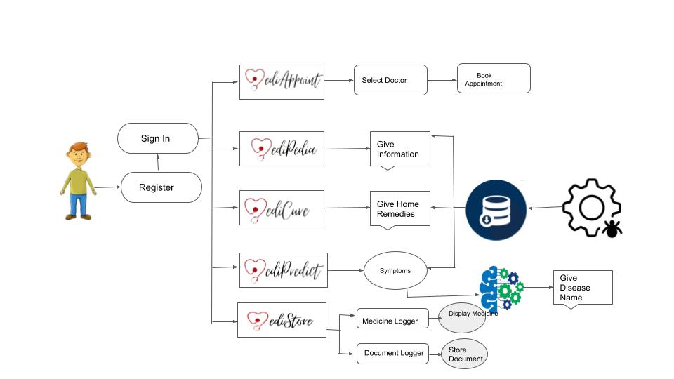
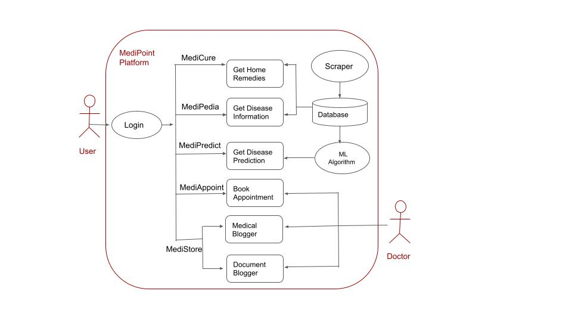

# Ingenious Hackathon 2.0


#### Team Name

Beta

#### Team Members

1. Gouri Nangliya (Team Leader)
2. Shiwani Bayas
3. Vaishnavi Patil
4. Anisha Gadagi
5. Riya Vidhale

### Problem Statement

We have been witnessing the wrath of the COVID-19 Pandemic for a year now. While this fatal airborne disease continues to spread around the globe, it has put health care facilities under immense pressure.  In most of the regions, hospitals are outnumbered by the increase in number of patients. Patients with normal cough, cold  or some trivial infection are not being attended without a negative report, even though the patient doesn’t show all symptoms of COVID-19. Through this platform, we aim to minimize the communication gap between the patient and the health care service providers by developing an online interface that can improve accessibility, quality of  treatment, avoid physical contact with any other person and reduce the long waiting hours. Medipoint is a mobile application which optimizes medical healthcare services and improvises patients' health care journey. It caters to the health care needs of the people by providing “At-Home Service”.

### Proposed Solution

MediPoint is an online healthcare platform which is designed for the greater good of the people.
1. User needs to install *MediPoint App*.
2. User needs to register on the App.
3. User can find all the information about diseases using *MediPedia*.
4. User can find home remedies for diseases using *MediCure*.
5. User can know the diseases based on symptoms using *MediPredict*.
6. User can book an appointment with doctor using *MediAppoint*.
7. User can use *MediStore* as a storage for medical documents and medicine logs.

#### MediAppoint
<!-- 
 -->
<br>
MediAppoint is the component of our application that deals with scheduling appointments of patients with their Doctors. We focus on saving our customers time and avoid the long waiting period. There is a transparency in the time-slot bookings, customer can check for the available slots and book an appointment as per his/her convenience. 
**Features** : <br/>
1. DB with list of Doctors 
2. Transparency of available slots
3. Book  slot according to your convenience
4. Confirmation send 
5. Avoid queue waiting period

#### MediPedia

<!--  -->

MediPedia is the encyclopedia of diseases at your fingertip. Customers can select a disease and get all information like the symptoms, causes, precautions etc. 
**Features** : <br/>
1. Create Database with Disease information
2. Web Scraping of disease websites
3. Select disease, get information
4. Encyclopedia of diseases at your fingertip

#### MediCure

<!--  -->

We live in a society where our Grandma’s Nuskha is the first step towards cure after every trivial infection. This component of MediPoint is a solution for the customer’s plight as it provides information about a First Aid treatment for an infection without having to visit the doctor in person. Medicure focuses on providing a home remedy for the selected disease/infection. 
**Features** : <br/>
1. Home remedies for diseases stored in database
2. Web Scraping from diseases website
3. Providing users with a First Aid treatment for the selected disease

#### MediPredict

<!--  -->

MediPredict is the component of MediPoint that predicts the disease after getting the symptoms of the customer as input. This component can help the customer to know what his/her symptoms signify and avoid jumping to impromptu conclusion.
**Features** : <br/>
1. Predict the disease by taking symptoms input from user
2. ML model using Decision Trees
3. Database source - Kaggle

#### MediStore
<!-- 
 -->

MediStore has two parts
Document Logger - Stores prescription and important documents of the user 
Medicine Logger - Logs medicines dose.
**Features** : <br/>
1. Storage destination for all the health care documents
2. Medicine Logger 
3. Documents  Logger


### Architecture

#### System Design



#### Use case



### Tech Stack


### Directory Structure
```
IngenuimHackathon
|-- Diagrams
|   |-- MediAppoint.png
|   |-- MediCure.jpg
|   |-- MediPedia.jpg
|   |-- MediPredict.jpg
|   |-- MediStore.jpg
|   |-- SystemDesign.jpg
|   |-- TechStack.png
|   `-- UseCase.png
|-- Logo
|   |-- MediAppoint.png
|   |-- MediCure.png
|   |-- MediPedia.png
|   |-- MediPoint.png
|   |-- MediPredict.png
|   `-- MediStore.png
|-- MediPredict
|   |-- MediPredict.json
|   |-- MeditPredict.csv
|   |-- README.md
|   |-- config.yaml
|   |-- dataset
|   |   |-- my_test.csv
|   |   |-- test_data.csv
|   |   `-- training_data.csv
|   |-- environment.yml
|   |-- main.py
|   `-- saved_model
|       `-- decision_tree.joblib
|-- README.md
|-- medipoint-client
|   |-- App.js
|   |-- README.md
|   |-- app.json
|   |-- assets
|   |   |-- Home.png
|   |   |-- Logo
|   |   |   `-- MediPoint.png
|   |   |-- Logout.jpg
|   |   |-- MediAppoint.png
|   |   |-- MediCure.jpg
|   |   |-- MediPedia.jpg
|   |   |-- MediPredict.png
|   |   |-- MediStore.png
|   |   |-- Profile.jpeg
|   |   |-- adaptive-icon.png
|   |   |-- favicon.png
|   |   |-- icon.png
|   |   |-- load.png
|   |   `-- splash.png
|   |-- babel.config.js
|   |-- components
|   |   |-- Auth
|   |   |   |-- Login.js
|   |   |   |-- Logout.js
|   |   |   `-- Register.js
|   |   |-- DrawerContainer.js
|   |   |-- HomeComponent.js
|   |   |-- MainComponent.js
|   |   |-- MediAppoint
|   |   |   |-- DoctorDetails.js
|   |   |   |-- TimeSlotBooking.js
|   |   |   `-- img
|   |   |       |-- dr_Maya.png
|   |   |       |-- dr_aniruddha.png
|   |   |       |-- dr_apurva.png
|   |   |       |-- dr_david.png
|   |   |       `-- dr_riddhima.png
|   |   |-- MediCure
|   |   |   |-- CureInfo.js
|   |   |   `-- MediCure.js
|   |   |-- MediPedia
|   |   |   |-- DiseasesInfo.js
|   |   |   `-- MediPedia.js
|   |   |-- MediPredict
|   |   |   `-- MediPredict.js
|   |   |-- MediStore
|   |   |   |-- DocumentsLogger.js
|   |   |   |-- MediStore.js
|   |   |   `-- MedicineLogger.js
|   |   `-- MenuButton.js
|   |-- config.js
|   |-- package-lock.json
|   |-- package.json
|   |-- screens
|   |   |-- CheckAppointments.js
|   |   |-- Loading.js
|   |   |-- ProfilePage.js
|   |   `-- WelcomeScreen.js
|   `-- yarn.lock
|-- medipoint-server
|   |-- app.js
|   |-- authenticate.js
|   |-- bin
|   |   `-- www
|   |-- config.js
|   |-- feature_correlation.png
|   |-- models
|   |   |-- cure.js
|   |   |-- disease.js
|   |   |-- doctor.js
|   |   |-- symptom.js
|   |   `-- user.js
|   |-- package-lock.json
|   |-- package.json
|   |-- public
|   |   |-- images
|   |   |-- javascripts
|   |   `-- stylesheets
|   |       `-- style.css
|   |-- routes
|   |   |-- cors.js
|   |   |-- cures.js
|   |   |-- diseases.js
|   |   |-- doctors.js
|   |   |-- index.js
|   |   |-- predict.js
|   |   |-- symptoms.js
|   |   `-- users.js
|   `-- views
|       |-- error.jade
|       |-- index.jade
|       `-- layout.jade
`-- scraper
    |-- MediCure.json
    |-- MediCureScaper.py
    |-- MediPedia.json
    `-- MediPediaScraper.py
```


### Installation Guide

1. Clone this repository:<br>
`git clone https://github.com/clue1ess/IngenuimHackathon.git`<br>
`cd IngenuimHackathon`<br>

2. To setup local mongodb databse,<br>
`mkdir database && cd database && mkdir data`<br>
`mongod --dbpath=data --bind_ip 127.0.0.1`<br>

3. To setup server, run<br>
`cd medipoint-server`<br>
`yarn install`<br>
`yarn start`<br>

4. To setup client, run<br>
`cd medipoint-client`<br>
`yarn install`<br>
`yarn start`<br>

### Demo

[Demo](https://youtu.be/j4A-4-MEePY)

### Impact on Stackeholders

1. **Saves Time** - Visting hospital for booking appointment is very time consuming and can be hectic now-a-days. MediAppoint can be your saviour.
2. **Book anything from anywhere** - Users are not limited to any specific working times of hospital for booking,they can book the appointment round the clock at anytime from anywhere.
3. **Save Resources** - MediAPoint is an automated appointment system as it removes the expensive of going hospital for manual booking
4. **Minimize communication gap between Doctors and Patients** - Patients can themselves get the info about the diseases using MediPoint app.
5. **First Aid treatment** - User can get home remedies for the diseases which can act as first aid or additional help in treatment of diseases.
6. **ML prediction of diseases using symptoms** - Helpful for users who are unsure about the disease 

**MediPoint can earn profit by**
1. Advertisement
2. Commision from hospitals
3. Companies can sponsor Medipoint under CSR.


### Future Scope

1. Integrating Messaging and Video call services for Doctors and patients interaction.
2. MediBot - Trained Bot which can help users to solve healthcare problems more efficiently.
3. Integrating Payment gateways for paying medical charges 
4. MediCare - online medicine/healthcare related products selling app
5. MediHabit - Schedule the healthly daily habits ike workout, eating vegetables, ect
6. MediDaily - Health news Channel
